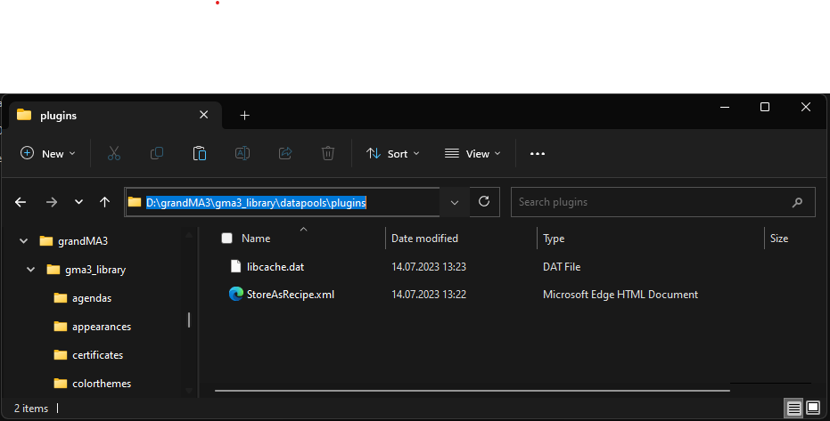
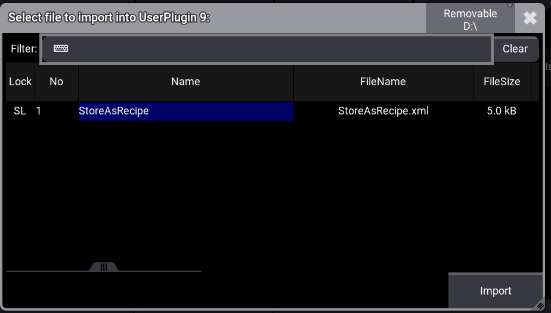

# GMA3_StoreAsRecipe

## Attention

as of now the plugin is published at www.gaphux.com.

A login is necessary but still free!

## Plugin Import
https://help2.malighting.com/Page/grandMA3/Plugins/en/1.9#toc_header_anchor_7

Load XML to your USB Stick

goto GrandMA3 Plugins, edit a New one and Import. Don't forget to Change location to USB Stick

